# Tazama Connection Studio (TCS) — Design-time Configuration Tool for FRMS

## Overview

Tazama Connection Studio (TCS) is a design-time configuration management platform that enables financial institutions to create, validate, and deploy transaction monitoring configurations without writing code. TCS serves as the bridge between business requirements and runtime execution by providing a visual interface for schema definition, data mapping configuration, and endpoint management.

**What TCS is:**

- A design-time configuration tool for creating FRMS monitoring rule
- A visual schema and mapping editor with validation
- A lifecycle management system for configuration artifacts
- A deployment orchestrator that exports packages to DEMS (Data Execution Management Service)

**What TCS is NOT:**

- A runtime transaction processing engine
- A real-time monitoring system
- A data storage or analytics platform

## Key Capabilities

- **Schema Creation and Versioning**: Define JSON-based transaction schemas with automatic version management
- **Advanced Mapping Configuration**: Support for DIRECT, SPLIT, CONCAT, CONSTANT, and FN_CALL mapping types
- **Dynamic Function Attachments**: Built-in functions (addEntity, addAccount, transactionDetails) for data enrichment
- **Endpoint Creation and Lifecycle**: Full Maker → Checker → Publisher workflow with approval gates
- **Multi-tenant Support**: Complete tenant isolation with RBAC and Keycloak role-based access control
- **Configuration Package Export**: Automated deployment package generation for DEMS consumption
- **Dynamic Data Model Generation**: Runtime table creation based on schema definitions
- **Simulation and Validation**: Pre-deployment testing and configuration validation
- **Audit Trail**: Complete configuration change tracking and versioning

## Architecture

### 4.1 High-Level Flow

```
Editor → TCS Backend → Admin Service → DEMS API → Runtime Execution
```

### 4.2 Detailed Architecture

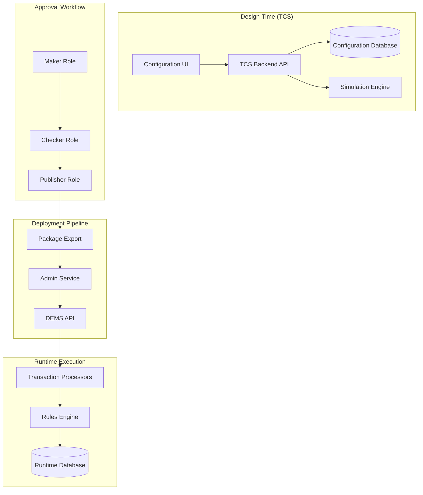

### 4.3 Configuration vs Runtime Separation

**Critical Design Principle**: TCS operates exclusively in design-time and never directly touches runtime transaction processing. All configurations created in TCS are exported as deployment packages and consumed by DEMS, which manages the runtime execution environment.

- **TCS Responsibility**: Schema definition, mapping configuration, validation, lifecycle management
- **DEMS Responsibility**: Package deployment, runtime configuration activation, transaction processing orchestration

## Folder Structure

```
src/
├── modules/
│   ├── auth/                 # Authentication & authorization
│   ├── config/              # Configuration management core
│   ├── tazama-data-model/   # Dynamic data model operations
│   ├── job/                 # Background job management
│   ├── scheduler/           # Task scheduling
│   ├── sftp/               # File transfer operations
│   ├── notification/       # Event notifications
│   └── simulation/         # Pre-deployment simulation
├── common/
│   ├── decorators/         # Custom decorators
│   ├── filters/           # Exception filters
│   ├── guards/            # Authorization guards
│   ├── interceptors/      # HTTP interceptors
│   └── pipes/            # Validation pipes
├── database/
│   ├── entities/         # Database entities
│   ├── migrations/       # Schema migrations
│   └── seeds/           # Test data
├── config/              # Application configuration
└── utils/              # Utility functions
```

## Prerequisites

- **Node.js**: 20+ (LTS recommended)
- **PostgreSQL**: 14+ with multi-tenant schema support
- **Redis/Valkey**: For session management and caching
- **NATS**: Message broker for notifications (optional)
- **Keycloak**: Identity and access management for RBAC
- **Docker Compose**: For local development environment

## Setup Instructions

### 7.1 Clone the Repository

```bash
git clone <repository-url>
cd connection-studio/backend
```

### 7.2 Install Dependencies

```bash
npm install
```

### 7.3 Configure Environment

```bash
cp .env.example .env
# Edit .env with your configuration
```

### 7.4 Start Dependencies

```bash
# Start PostgreSQL, Redis, and Keycloak
docker-compose up -d postgres redis keycloak
```

### 7.5 Run Database Migrations

```bash
npm run migration:run
npm run seed:dev
```

### 7.6 Start the Service

```bash
# Development mode
npm run start:dev

# Production mode
npm run start:prod
```

## Environment Variables

### Application Variables

```bash
NODE_ENV=development
PORT=3000
API_PREFIX=/api/v1
SESSION_TIMEOUT_MINUTES=30
```

### Database Variables

```bash
DB_HOST=localhost
DB_PORT=5432
DB_NAME=tcs
DB_USERNAME=postgres
DB_PASSWORD=postgres
DB_SCHEMA_PREFIX=tenant_
```

### Redis Variables

```bash
REDIS_HOST=localhost
REDIS_PORT=6379
REDIS_PASSWORD=
REDIS_DB=0
```

### 8.1 Multi-Tenant Variables

```bash
DEFAULT_TENANT_ID=default
STRICT_TENANT_VALIDATION=true
TENANT_SCHEMA_CREATION=auto
```

### 8.2 Keycloak / RBAC Variables

```bash
KEYCLOAK_URL=http://localhost:8080
KEYCLOAK_REALM=tazama
KEYCLOAK_CLIENT_ID=tcs-backend
KEYCLOAK_CLIENT_SECRET=your-client-secret
```

## Core Concepts

### 9.1 Schema Definitions

JSON-based transaction schemas that define the structure of incoming financial messages:

```json
{
  "schemaId": "pain_001_v1",
  "version": "1.0.0",
  "namespace": "/TCS/v1/default/schema/pain_001",
  "definition": {
    "type": "object",
    "properties": {
      "GrpHdr": {
        "type": "object",
        "properties": {
          "MsgId": { "type": "string" },
          "CreDtTm": { "type": "string", "format": "date-time" }
        }
      }
    }
  }
}
```

**Versioning Rules**:

- Semantic versioning (MAJOR.MINOR.PATCH)
- Backward compatibility enforcement
- Automatic migration path generation

### 9.2 Mapping Engine

The mapping engine supports five transformation types:

#### DIRECT Mapping

```json
{
  "type": "DIRECT",
  "source": "$.GrpHdr.MsgId",
  "target": "messageId"
}
```

#### CONCAT Mapping

```json
{
  "type": "CONCAT",
  "sources": ["$.GrpHdr.MsgId", "$.GrpHdr.CreDtTm"],
  "separator": "_",
  "target": "compositeKey"
}
```

#### SPLIT Mapping

```json
{
  "type": "SPLIT",
  "source": "$.CdtTrfTxInf.Amt",
  "delimiter": ".",
  "targets": ["amount", "currency"]
}
```

#### CONSTANT Mapping

```json
{
  "type": "CONSTANT",
  "value": "PAYMENT",
  "target": "transactionType"
}
```

#### FUNCTION Mapping

```json
{
  "type": "FN_CALL",
  "function": "addEntity",
  "parameters": {
    "entityId": "$.GrpHdr.InstgAgt.FinInstnId.ClrSysMmbId.MmbId",
    "entityType": "FINANCIAL_INSTITUTION"
  },
  "target": "enrichedEntity"
}
```

### 9.3 Dynamic Functions

Built-in functions for data enrichment and processing:

- **addEntity**: Enriches transaction with entity information
- **addAccount**: Adds account details and history
- **addDataModelTable**: Creates dynamic tables based on schema
- **transactionDetails**: Standardizes transaction format

### 9.4 Endpoint Definitions

Configuration structure for API endpoint generation:

```json
{
  "endpointId": "pain_001_processor",
  "path": "/api/v1/evaluate/pain.001",
  "method": "POST",
  "schemaId": "pain_001_v1",
  "mappingId": "pain_001_mapping_v1",
  "functions": ["addEntity", "addAccount"],
  "validation": {
    "required": true,
    "strictMode": false
  }
}
```

### 9.5 Lifecycle Management

Configuration artifacts follow a strict approval workflow:

```
Maker → Checker → Publisher → Deployed
```

**Status Codes**:

- `STATUS_01_IN_PROGRESS`: Initial creation/editing
- `STATUS_02_READY_FOR_APPROVAL`: Submitted for review
- `STATUS_03_APPROVED`: Approved by checker
- `STATUS_07_READY_FOR_DEPLOYMENT`: Ready for deployment
- `STATUS_09_DEPLOYED`: Successfully deployed to runtime

### 9.6 Versioning Rules

- **Schemas**: Major version changes require new approval cycle
- **Mappings**: Linked to specific schema versions
- **Endpoints**: Version independently but reference specific schema/mapping versions

### 9.7 Namespaces

All artifacts are organized in hierarchical namespaces:

```
/TCS/v1/{tenantId}/schema/{schemaName}
/TCS/v1/{tenantId}/mapping/{mappingName}
/TCS/v1/{tenantId}/endpoint/{endpointName}
```

### 9.8 Deployment Packages

TCS exports signed, versioned packages for DEMS consumption:

```json
{
  "packageId": "pkg_20241211_001",
  "version": "1.0.0",
  "tenantId": "tenant_001",
  "artifacts": [
    {
      "type": "schema",
      "id": "pain_001_v1",
      "checksum": "sha256:abc123..."
    }
  ],
  "signature": "digital_signature_hash",
  "exportedAt": "2024-12-11T19:30:00Z"
}
```

## Database Schema

### 10.1 List of Tables

**Core Configuration Tables**:

- `config`: Main configuration storage
- `destination`: Data destination definitions
- `destination_type`: Collection type mappings
- `destination_type_fields`: Field definitions

**Lifecycle Management**:

- `approval_workflow`: Approval state tracking
- `version_history`: Configuration version management
- `deployment_log`: Deployment tracking

**Multi-tenancy**:

- `tenants`: Tenant definitions
- `tenant_schemas`: Per-tenant schema isolation

### 10.2 Detailed Table Descriptions

#### config Table

**Purpose**: Stores main configuration artifacts (schemas, mappings, endpoints)

| Column           | Type         | Description                     |
| ---------------- | ------------ | ------------------------------- |
| id               | SERIAL       | Primary key                     |
| msg_fam          | VARCHAR(255) | Message family identifier       |
| transaction_type | VARCHAR(255) | Transaction type classification |
| endpoint_path    | VARCHAR(255) | API endpoint path               |
| schema           | JSONB        | Configuration schema definition |
| mapping          | JSONB        | Data mapping configuration      |
| tenant_id        | VARCHAR(255) | Tenant identifier               |
| status           | VARCHAR(255) | Lifecycle status                |
| version          | VARCHAR(255) | Semantic version                |
| created_by       | VARCHAR(255) | Creator user ID                 |
| created_at       | TIMESTAMPTZ  | Creation timestamp              |
| updated_at       | TIMESTAMPTZ  | Last update timestamp           |

**Example Row**:

```sql
INSERT INTO config VALUES (
  1,
  'pain.001',
  'CREDIT_TRANSFER',
  '/api/v1/evaluate/pain.001',
  '{"type": "object", "properties": {...}}',
  '[{"type": "DIRECT", "source": "$.GrpHdr.MsgId", "target": "messageId"}]',
  'tenant_001',
  'STATUS_01_IN_PROGRESS',
  '1.0.0',
  'user@example.com',
  NOW(),
  NOW()
);
```

#### destination Table

**Purpose**: Defines data output destinations for processed transactions

| Column           | Type        | Description            |
| ---------------- | ----------- | ---------------------- |
| destination_id   | SERIAL      | Primary key            |
| destination_name | VARCHAR     | Destination identifier |
| created_at       | TIMESTAMPTZ | Creation timestamp     |
| updated_at       | TIMESTAMPTZ | Last update timestamp  |

#### destination_type Table

**Purpose**: Maps collection types to destinations for data organization

| Column              | Type         | Description                |
| ------------------- | ------------ | -------------------------- |
| destination_type_id | SERIAL       | Primary key                |
| collection_type     | VARCHAR(255) | Type of data collection    |
| name                | VARCHAR(255) | Human-readable name        |
| destination_id      | INTEGER      | Foreign key to destination |
| tenant_id           | VARCHAR(50)  | Tenant identifier          |
| created_at          | TIMESTAMPTZ  | Creation timestamp         |
| updated_at          | TIMESTAMPTZ  | Last update timestamp      |

### 10.3 ERD Diagram

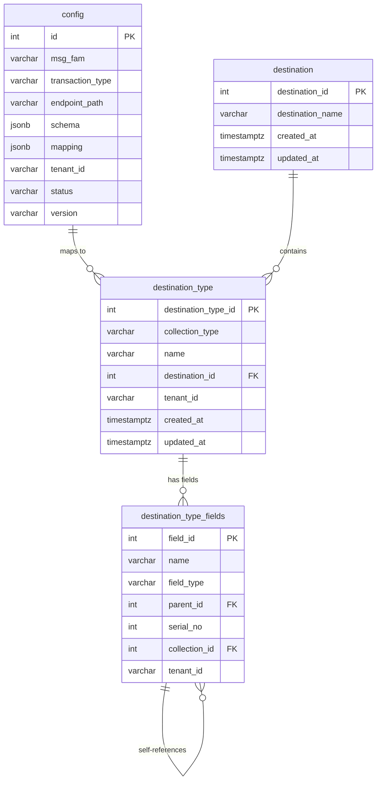

## Internal Processing Flow

### 11.1 Authentication Flow

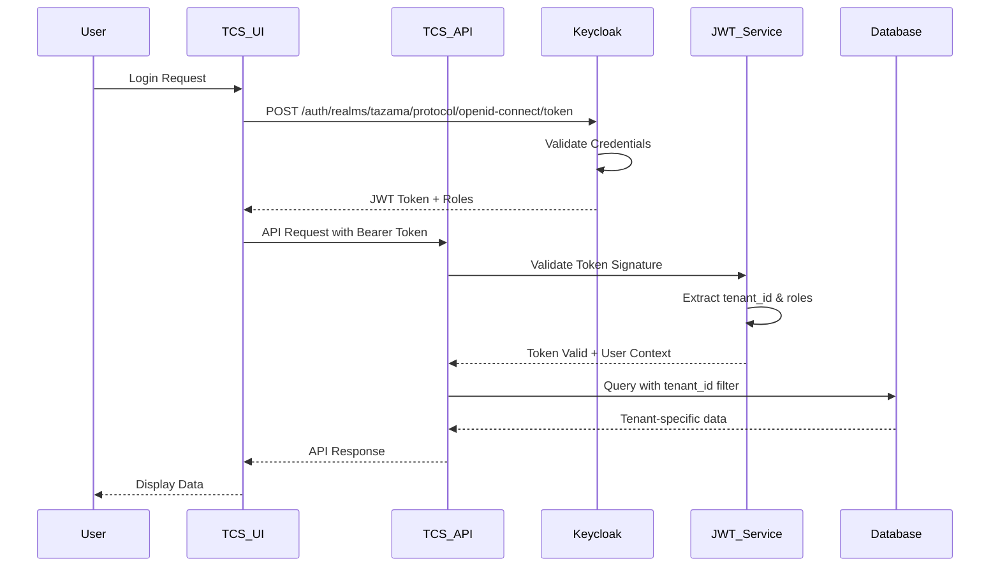

### 11.2 Create Schema Flow

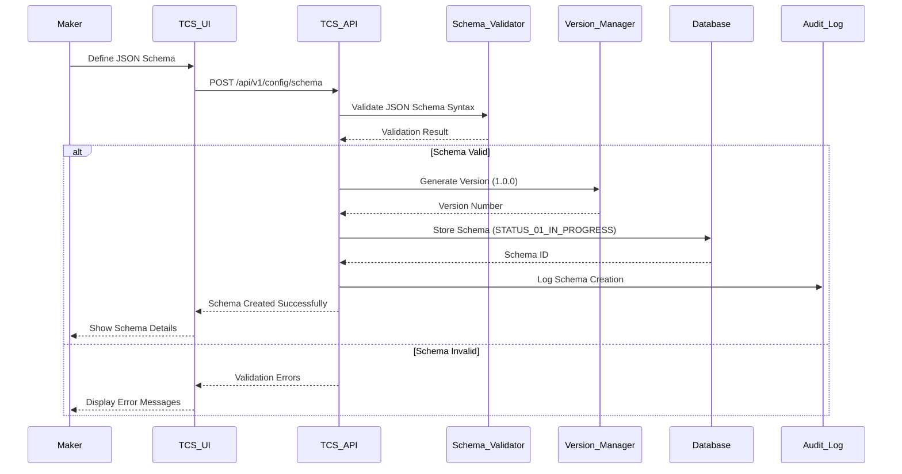

### 11.3 Create Mapping Flow

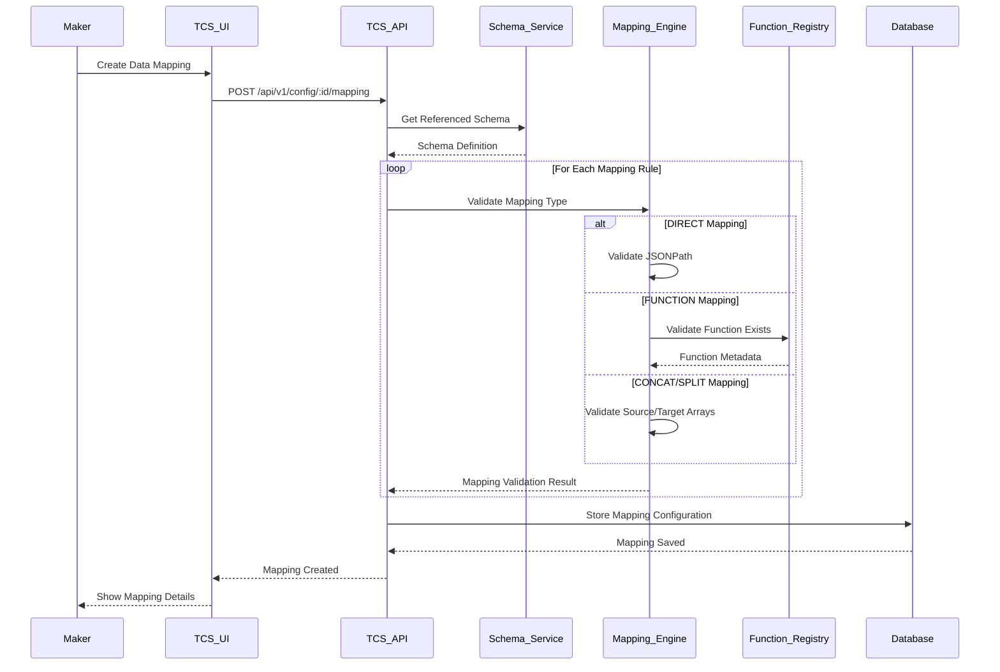

### 11.4 Function Attachment Flow

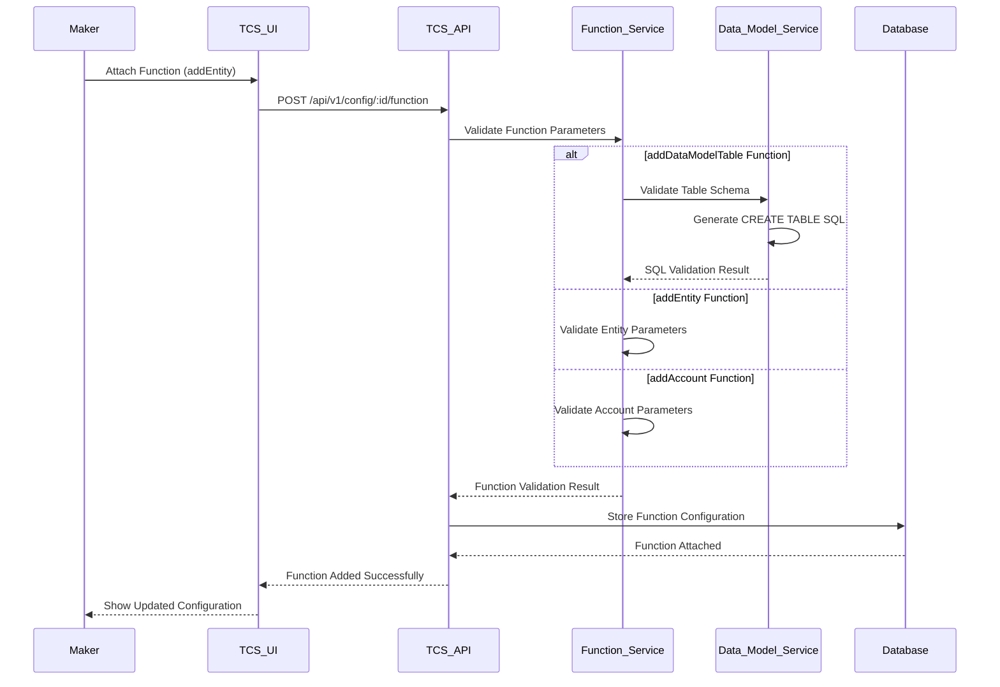

### 11.5 Simulation Flow

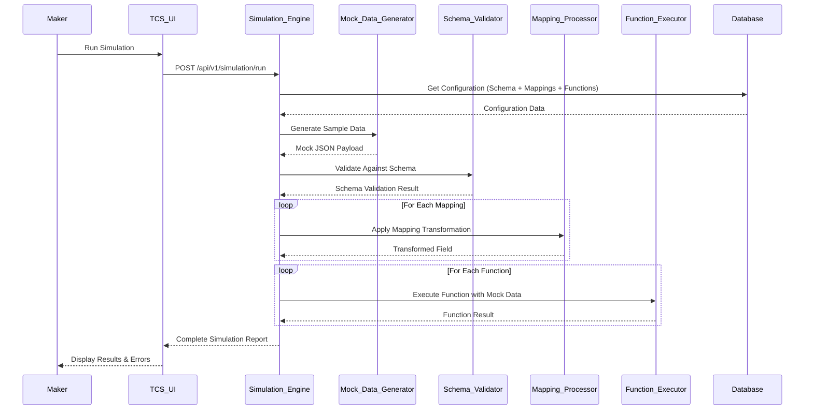

### 11.6 Approval Workflow (Maker → Checker → Publisher)

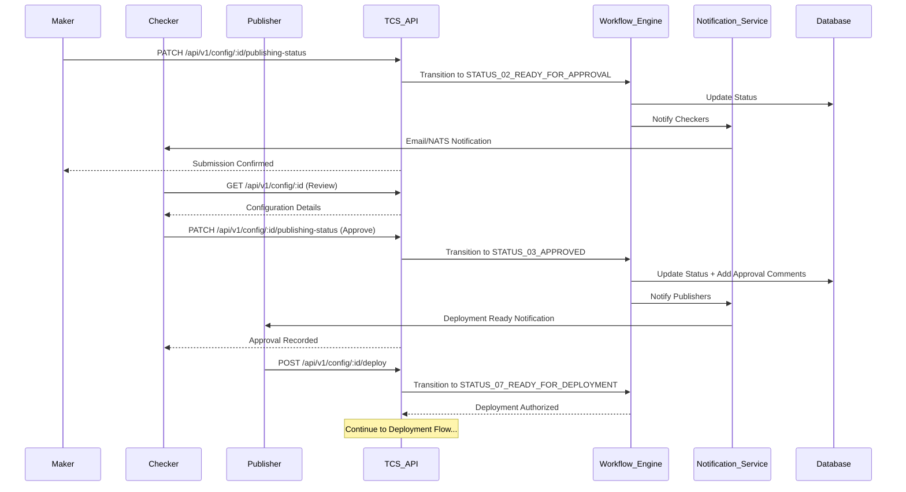

### 11.7 Complete Deployment Flow

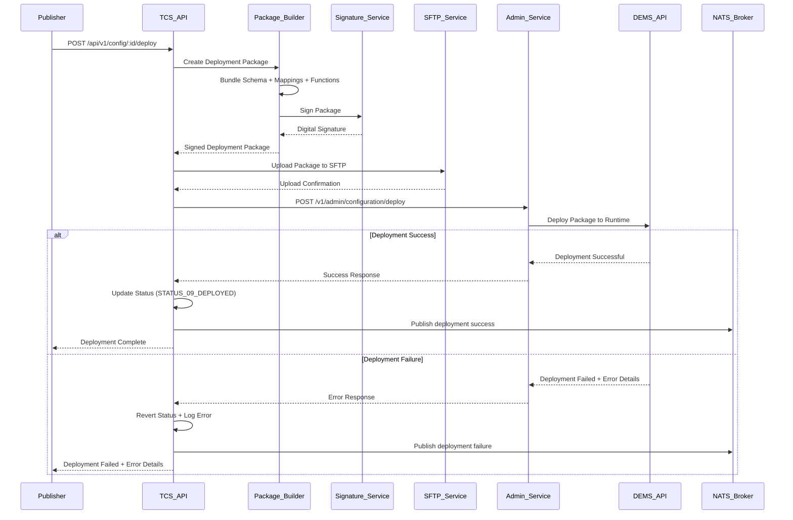

### 11.8 Dynamic Table Creation Flow

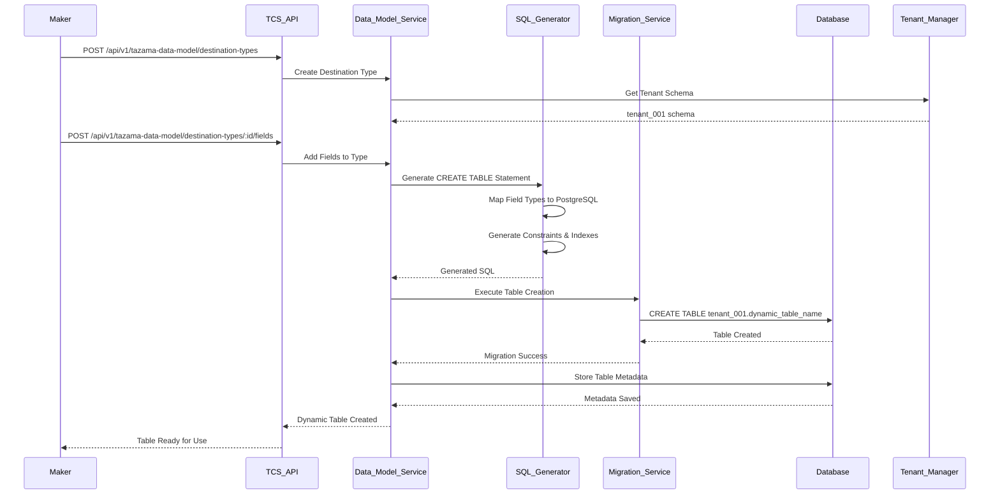

## API Documentation

### 12.1 Core API Endpoints

#### Configuration Management

```bash
# Create configuration
POST /api/v1/config
Authorization: Bearer <token>
Content-Type: application/json

# Get configuration
GET /api/v1/config/:id
Authorization: Bearer <token>

# Update configuration
PUT /api/v1/config/:id
Authorization: Bearer <token>

# Submit for approval
PATCH /api/v1/config/:id/publishing-status
Authorization: Bearer <token>

# Search configurations
POST /api/v1/config/:offset/:limit
Authorization: Bearer <token>
```

#### Schema Management

```bash
# Create schema
POST /api/v1/config/schema
Authorization: Bearer <token>
Content-Type: application/json

{
  "msg_fam": "pain.001",
  "transaction_type": "CREDIT_TRANSFER",
  "schema": {
    "type": "object",
    "properties": {
      "GrpHdr": {
        "type": "object",
        "properties": {
          "MsgId": {"type": "string"},
          "CreDtTm": {"type": "string", "format": "date-time"}
        },
        "required": ["MsgId", "CreDtTm"]
      }
    },
    "required": ["GrpHdr"]
  },
  "tenant_id": "tenant_001"
}
```

#### Mapping Configuration

```bash
# Create mapping
POST /api/v1/config/:id/mapping
Authorization: Bearer <token>

{
  "mappings": [
    {
      "type": "DIRECT",
      "source": "$.GrpHdr.MsgId",
      "target": "messageId"
    },
    {
      "type": "FN_CALL",
      "function": "addEntity",
      "parameters": {
        "entityId": "$.GrpHdr.InstgAgt.FinInstnId.ClrSysMmbId.MmbId"
      },
      "target": "enrichedEntity"
    }
  ]
}
```

#### Dynamic Data Model

```bash
# Get destination options
GET /api/v1/tazama-data-model/destination-options
Authorization: Bearer <token>

# Create destination type
POST /api/v1/tazama-data-model/destination-types
Authorization: Bearer <token>

{
  "collection_type": "transaction_details",
  "name": "Payment Transactions",
  "destination_id": 1,
  "tenant_id": "tenant_001"
}

# Add fields to destination type
POST /api/v1/tazama-data-model/destination-types/:id/fields
Authorization: Bearer <token>

{
  "fields": [
    {
      "name": "message_id",
      "field_type": "string",
      "required": true,
      "serial_no": 1
    },
    {
      "name": "amount",
      "field_type": "number",
      "required": true,
      "serial_no": 2
    }
  ]
}
```

### 12.2 Error Codes

| Status Code | Error Type            | Description                                      |
| ----------- | --------------------- | ------------------------------------------------ |
| 400         | Bad Request           | Invalid request payload or parameters            |
| 401         | Unauthorized          | Missing or invalid authentication token          |
| 403         | Forbidden             | Insufficient permissions for operation           |
| 404         | Not Found             | Configuration or resource not found              |
| 409         | Conflict              | Configuration already exists or version conflict |
| 422         | Unprocessable Entity  | Validation errors in schema or mapping           |
| 500         | Internal Server Error | Server-side processing error                     |

### 12.3 Authorization Requirements

All endpoints require JWT authentication with appropriate role-based permissions:

- **Maker Role**: Create and edit configurations
- **Checker Role**: Approve/reject configurations
- **Publisher Role**: Deploy configurations to runtime
- **Admin Role**: Full system access and tenant management

## Authentication & RBAC

TCS integrates with Keycloak for comprehensive identity and access management:

### Role Definitions

- **tcs-maker**: Can create and modify configurations
- **tcs-checker**: Can review and approve configurations
- **tcs-publisher**: Can deploy approved configurations
- **tcs-admin**: Full administrative access

### Token Structure

```json
{
  "sub": "user@example.com",
  "realm_access": {
    "roles": ["tcs-maker", "tcs-checker"]
  },
  "tenant_id": "tenant_001",
  "exp": 1703123456
}
```

### Authorization Flow

1. User authenticates with Keycloak
2. TCS validates JWT token signature
3. Extracts tenant_id and roles from token
4. Enforces role-based access to endpoints
5. Applies tenant-based data isolation

## Multi-Tenancy

TCS provides complete tenant isolation at multiple levels:

### Database Isolation

- Each tenant has a dedicated PostgreSQL schema (`tenant_001`, `tenant_002`, etc.)
- Cross-tenant data access is strictly prohibited
- Automatic schema creation for new tenants

### API Isolation

- Tenant ID extracted from JWT token
- All database queries filtered by tenant_id
- Tenant-specific configuration namespaces

### Deployment Isolation

- Tenant-specific deployment packages
- Separate runtime environments per tenant
- Independent version management

## Simulation Engine

The simulation engine provides comprehensive pre-deployment validation:

### Validation Checks

- **Schema Validation**: Verify JSON schema compliance
- **Mapping Validation**: Test all mapping transformations
- **Function Validation**: Validate dynamic function calls
- **Endpoint Resolution**: Verify API endpoint accessibility
- **Data Flow Testing**: End-to-end data transformation testing

### Simulation Process

1. Generate mock data based on schema
2. Apply all configured mappings
3. Execute dynamic functions with test parameters
4. Validate output against expected format
5. Generate detailed validation report

## Dynamic Data Model Generation

TCS can automatically generate database tables based on schema definitions:

### Table Generation Process

1. Analyze schema structure and field definitions
2. Generate CREATE TABLE statements with appropriate data types
3. Handle composite primary keys and foreign key relationships
4. Apply tenant-specific naming conventions
5. Execute migrations with rollback support

### Naming Conventions

- Tables: `{tenant_id}_{schema_name}_{version}`
- Columns: Derived from schema field names
- Indexes: Automatic generation for primary and foreign keys

## Deployment Workflow (Maker/Checker/Publisher)

### 17.1 Workflow States

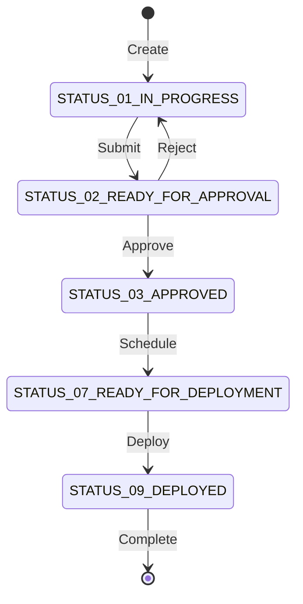

### 17.2 State Transitions

| From State                     | To State                       | Required Role | Action                |
| ------------------------------ | ------------------------------ | ------------- | --------------------- |
| -                              | STATUS_01_IN_PROGRESS          | Maker         | Create configuration  |
| STATUS_01_IN_PROGRESS          | STATUS_02_READY_FOR_APPROVAL   | Maker         | Submit for review     |
| STATUS_02_READY_FOR_APPROVAL   | STATUS_01_IN_PROGRESS          | Checker       | Reject with comments  |
| STATUS_02_READY_FOR_APPROVAL   | STATUS_03_APPROVED             | Checker       | Approve configuration |
| STATUS_03_APPROVED             | STATUS_07_READY_FOR_DEPLOYMENT | Publisher     | Schedule deployment   |
| STATUS_07_READY_FOR_DEPLOYMENT | STATUS_09_DEPLOYED             | System        | Auto-deploy via DEMS  |

### 17.3 Approval Rules

- Makers cannot approve their own configurations
- Checkers must provide approval comments
- Publishers can only deploy approved configurations
- Emergency deployments require admin override

## Testing

### 19.1 Unit Tests

```bash
# Run all unit tests
npm run test

# Run specific module tests
npm run test -- --testPathPattern=config

# Generate coverage report
npm run test:cov
```

### 19.2 Integration Tests

```bash
# Run integration test suite
npm run test:integration

# Test database operations
npm run test:db
```

### 19.3 E2E Tests

```bash
# Run end-to-end tests
npm run test:e2e

# Test complete workflows
npm run test:workflow
```

### 19.4 Mock Data

Test data sets are provided for all major transaction types:

- `pain.001` credit transfers
- `pain.013` creditor payment activations
- `pacs.002` payment status reports
- `pacs.008` financial institution credit transfers

## Troubleshooting

### Common Issues

#### Tenant Mismatch

**Error**: `403 Forbidden: Tenant mismatch`
**Solution**: Verify JWT token contains correct tenant_id and user has access to specified tenant

#### Mapping Simulation Errors

**Error**: `Mapping validation failed: Invalid JSONPath expression`
**Solution**: Check JSONPath syntax and verify source data structure matches schema

#### Dynamic Table Creation Failures

**Error**: `Table creation failed: Column type mismatch`
**Solution**: Review schema field types and ensure compatibility with PostgreSQL data types

#### Admin Service Communication Issues

**Error**: `503 Service Unavailable: Admin Service unreachable`
**Solution**:

1. Check Admin Service URL configuration
2. Verify network connectivity
3. Confirm Admin Service authentication

#### Keycloak Token Errors

**Error**: `401 Unauthorized: Invalid token signature`
**Solution**:

1. Verify Keycloak configuration
2. Check token expiration
3. Validate public key configuration

## Logging & Monitoring

### Request/Response Logs

```json
{
  "timestamp": "2024-12-11T19:30:00Z",
  "level": "INFO",
  "method": "POST",
  "path": "/api/v1/config",
  "userId": "user@example.com",
  "tenantId": "tenant_001",
  "responseTime": 150,
  "statusCode": 201
}
```

### Audit Logs

```json
{
  "timestamp": "2024-12-11T19:30:00Z",
  "action": "CONFIG_APPROVED",
  "configId": "cfg_001",
  "userId": "checker@example.com",
  "tenantId": "tenant_001",
  "previousStatus": "STATUS_02_READY_FOR_APPROVAL",
  "newStatus": "STATUS_03_APPROVED"
}
```

### Health Endpoints

- `GET /health`: Application health status
- `GET /health/db`: Database connectivity
- `GET /health/keycloak`: Keycloak connectivity
- `GET /health/admin-service`: Admin Service connectivity

## Contribution Guidelines

### Branching Strategy

- `main`: Production-ready code
- `develop`: Integration branch for features
- `feature/*`: Individual feature development
- `hotfix/*`: Critical production fixes

### Commit Conventions

```
feat: add schema versioning support
fix: resolve mapping validation error
docs: update API documentation
test: add unit tests for config module
```

### Pull Request Rules

1. All tests must pass
2. Code coverage must not decrease
3. Documentation must be updated
4. At least one reviewer approval required

## License

Apache-2.0 License. See [LICENSE](LICENSE) file for details.

## Maintainers

- **Technical Lead**: engineering@tazama.org
- **Product Owner**: product@tazama.org
- **DevOps**: devops@tazama.org

For support and questions:

- Create an issue in the repository
- Join our Slack workspace: #tazama-connection-studio
- Email support: support@tazama.org
